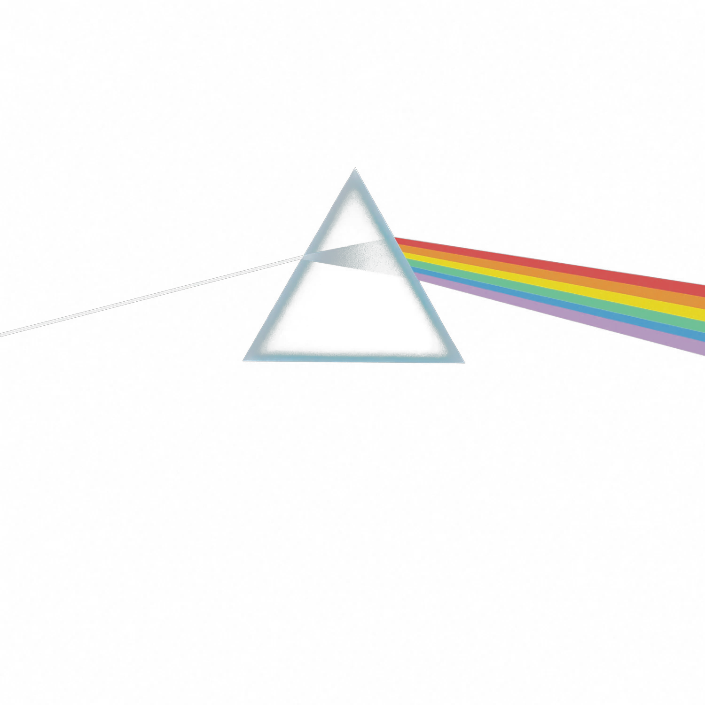

# Opa bão

<table>
<tr>
<td width="60%" valign="top">

### Sobre mim
🎓 Estudante do curso de Ciência da Computação pela Univasf (6/?)
👨🏻‍💻 Leve apreciador de C/C++
🖥️ Ainda iniciante na área de programação mas já tenho familiaridade em C e Java
🎵 Viciado em música
🕹️ No tempo livre gosto de jogar algo (principalmente Fortnite) ou ver alguma série

</td>
<td width="40%" align="center">

</td>
</tr>
</table>

### 💻 Tecnologias e ferramentas

  

### 📫 Redes de contatos

### 🐍 Atividade no GitHub

<picture>
  <source media="(prefers-color-scheme: dark)" srcset="https://raw.githubusercontent.com/spinkflloyd/spinkflloyd/output/github-contribution-grid-snake-dark.svg">
  <source media="(prefers-color-scheme: light)" srcset="https://raw.githubusercontent.com/spinkflloyd/spinkflloyd/output/github-contribution-grid-snake.svg">
  
</picture>

