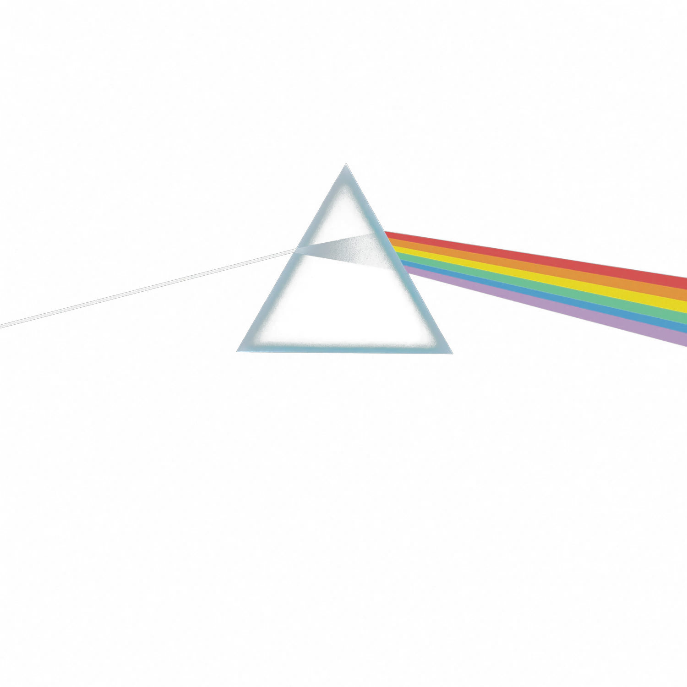

# Opa bão

<table>
<tr>

<td width="60%" valign="top">

### Sobre mim ###

🎓 Estudante de Ciência da Computação pela Univasf

🖥️ Ainda iniciante em programação, mas já tenho certa familiaridade em C e Java

🎵 Viciado em música

🕹️ No tempo livre gosto de jogar, ou assistir alguma série

</td>

<td width="40%" align="center">

</td>

</tr>
</table>

### 💻 Linguagens de programação ###

  
  
  
  
  
  

### 🛠️ Tecnologias e ferramentas ###

  
  
  
  
  
  
  
  
  
  
  
  

### 📊 Estatísticas do GitHub

  
  

### 📫 Redes de contatos ###

### 🐍 Minhas contribuições ###

<picture>
  <source media="(prefers-color-scheme: dark)" srcset="https://raw.githubusercontent.com/spinkflloyd/spinkflloyd/output/github-contribution-grid-snake-dark.svg">
  <source media="(prefers-color-scheme: light)" srcset="https://raw.githubusercontent.com/spinkflloyd/spinkflloyd/output/github-contribution-grid-snake.svg">
  
</picture>
